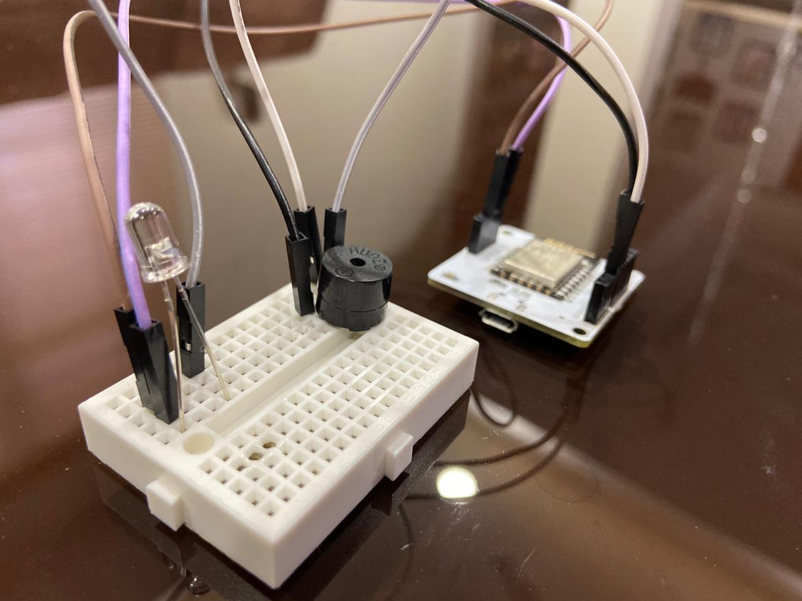
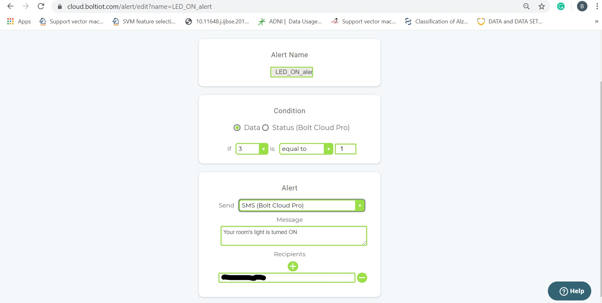
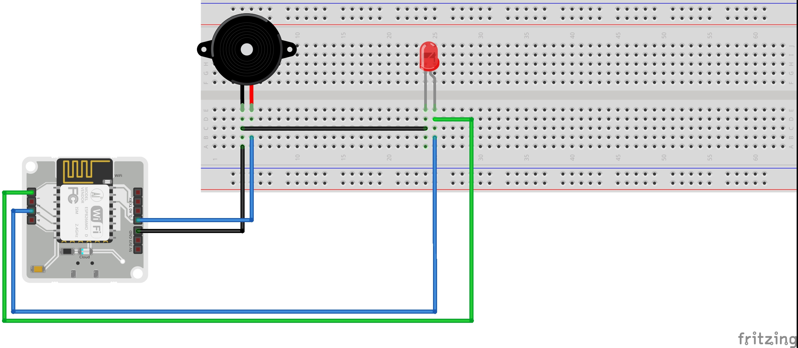

# SETUP

## INTRODUCTION
Using traditional Alarm clocks for waking you up from Sleep cannot be an ideal way for actually WAKING YOU UP! You can simply turn it OFF and go to sleep again, consecutively, missing out your important events that you were supposed to do after waking up. Also, Turning ON your room's light after you wake up from a Good Sleep can feel lethargic.
This Smart Alarm Clock with Automated Room Lighting feature can successfully wake you up on time and automatically switch ON your room's light for a clear sight of your room as soon as you wake up. You just have to set your desired wake up time in this alarm clock, and whenever the wake-up time has reached the alarm starts ringing. It keeps on ringing until and unless you switch it OFF by clicking the STOP ALARM button.
As soon as you click the STOP ALARM button, the alarm stop ringing, and simultaneously your room's light gets turned ON automatically.
Additionally, as a part of an alert system, you will receive an SMS on your mobile phone when the room's light is turned ON and OFF. This will let you know if anyone has entered your room after you have left it. Also, it will ensure whether the lights were switched OFF or not once after they were turned ON, thus ensuring Electric Energy Conservation.

## Things used in this project
### Hardware components
• Bolt IoT Bolt WiFi Module  
• Buzzer  
• LED  
• Jumper Wires (generic)  
• Bread Board  
• USB cable  
• Power Source  
### Software apps and Online services
• Bolt IoT Bolt Cloud  

## Steps for Building This Project

### Hardware Section

The following are the steps that can be followed in order to make the hardware connections of the project:-

Step 1. Insert the buzzer on the Bread Board.

Step 2. Using a male-to-male jumper wire, connect the negative pin(i.e., the shorter leg) of the buzzer to the Ground supply of the BOLT Wifi Module.

Step 3. Using another male-to-male jumper wire, connect the positive pin(i.e., the longer leg) of the buzzer to the GPIO pin '0' of the BOLT Wifi Module.

Step 4. Insert the LED at another location(at some distance from buzzer) on the Bread Board.

Step 5. Using another jumper wire take the Ground supply of the BOLT Wifi Module from the Bread Board to connect it to the negative pin(i.e., the shorter leg) of LED.

Step 6. Using another male-to-male jumper wire, connect the positive pin(i.e., the longer leg) of LED to the GPIO pin '1' of the BOLT Wifi Module.

Step 7. Using another jumper wire, connect the output of LED(coming at the longer leg on Bread Board) to the GPIO pin '3'. This will be required to read the status of the LED.

That's it, the hardware connections have been done successfully.

After the connections, the final circuit will look as below.  

### Software Section

## Bolt Cloud
Step 1. For setting up the BOLT Cloud, you just have to create an account on the BOLT Cloud. 

Step 2. Then ADD PRODUCT on the cloud. Give suitable Product Name. Select Output devices and GPIO. 

Step 3. Next, link your BOLT Wifi Module with this product. The HTML code configuration has been attached. Click on VIEW DEVICE to view the device. 

Step 4. Next, to read the status of the LED we will set up an ALERT on BOLT Cloud(NOTE: Alert feature will only be available for API Pro Plan users). 

Step 5. Click on the Alerts tab on BOLT Cloud. Next, click on the configure button and configure the "LIGHTS ON" Alert as shown in the image below. In the Recipients list, add the mobile number on which you want to receive the alert message.    

Step 6. Enable the Alert by click on the ON/OFF toggle and finally save the configuration. 

Step 7. Finally, link your device(which you have linked with your project) to this alert. 

Step 8. Repeat steps 5, 6 & 7 to add a new Alert for receiving the"LIGHTS OFF" Message. Configure the OFF Alert as below.    

## Schematics

It shows the hardware circuit connection

  
